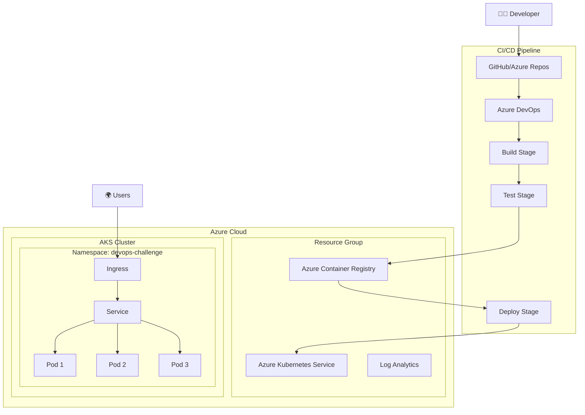

# 🚀 DevOps Challenge - Solução Completa

> **Uma solução DevOps robusta e escalável usando Azure, Terraform, Docker, Kubernetes e Azure DevOps**


## 📋 Índice

- [🎯 Visão Geral](#-visão-geral)
- [🏗️ Arquitetura](#️-arquitetura)
- [🛠️ Stack Tecnológica](#️-stack-tecnológica)
- [📁 Estrutura do Projeto](#-estrutura-do-projeto)
- [🚀 Quick Start](#-quick-start)
- [📖 Guias Detalhados](#-guias-detalhados)
- [🔧 Configuração](#-configuração)
- [🧪 Testes](#-testes)
- [📊 Monitoramento](#-monitoramento)
- [🛡️ Segurança](#️-segurança)
- [📚 Documentação Adicional](#-documentação-adicional)

## 🎯 Visão Geral

Este projeto implementa uma solução DevOps completa e moderna, demonstrando as melhores práticas de:

✅ **Infraestrutura como Código** com Terraform  
✅ **Containerização** com Docker otimizado  
✅ **Orquestração** com Kubernetes (AKS)  
✅ **CI/CD** automatizado com Azure DevOps  
✅ **Gerenciamento de Pacotes** com Helm  
✅ **Monitoramento** e observabilidade  
✅ **Segurança** em todas as camadas  

### 🎪 Demo Online

A aplicação está rodando em: `https://devops-challenge.azurewebsites.net` (quando deployada)

## 🏗️ Arquitetura



## 🛠️ Stack Tecnológica

| Categoria | Tecnologia | Versão | Descrição |
|-----------|------------|--------|-----------|
| **🏗️ IaC** | Terraform | ~> 1.0 | Infraestrutura como código |
| **🐳 Container** | Docker | Latest | Containerização da aplicação |
| **☸️ Orquestração** | Kubernetes | 1.28+ | Orquestração de containers |
| **🚀 CI/CD** | Azure DevOps | - | Pipeline de integração contínua |
| **📦 Package Manager** | Helm | 3.x | Gerenciamento de pacotes K8s |
| **☁️ Cloud** | Microsoft Azure | - | Provedor de nuvem |
| **🖥️ Runtime** | Node.js | 20.x | Runtime da aplicação |
| **🌐 Framework** | Express.js | 4.x | Framework web |

## 📁 Estrutura do Projeto

```
techmart-catalog-api/
├── 📱 app/                          # Aplicação
│   ├── 🐳 Dockerfile               # Multi-stage Docker build
│   ├── 📄 .dockerignore            # Arquivos ignorados no build
│   └── 📂 src/                     # Código fonte
│       ├── 📦 package.json         # Dependências Node.js
│       └── 🖥️ server.js            # Aplicação Express
├── 🏗️ terraform/                   # Infraestrutura como Código
│   ├── 🎯 main.tf                  # Recursos principais
│   ├── 📝 variables.tf             # Variáveis de entrada
│   ├── 📊 outputs.tf               # Outputs do Terraform
│   ├── 📋 terraform.tfvars.example # Exemplo de variáveis
│   ├── 📋 terraform.tfvars.economico # Configuração econômica
│   └── 📖 README.md                # Documentação do Terraform
├── 📦 helm/                        # Chart Helm
│   ├── 📄 Chart.yaml               # Metadados do chart
│   ├── ⚙️ values.yaml              # Valores padrão
│   └── 📂 templates/               # Templates Kubernetes
│       ├── 🚀 deployment.yaml     # Deployment da aplicação
│       ├── 🌐 service.yaml         # Service Kubernetes
│       ├── 🔐 serviceaccount.yaml  # Service Account
│       ├── 🌍 ingress.yaml         # Ingress Controller
│       ├── 🔒 networkpolicy.yaml   # Network Policy
│       └── 🔧 _helpers.tpl         # Helpers do Helm
├── 📜 scripts/                     # Scripts de automação
│   ├── 🔧 01-setup-azure.ps1      # Configuração inicial do Azure
│   ├── 🏗️ 02-deploy-infrastructure.ps1  # Deploy da infraestrutura
│   ├── 🚀 03-deploy-application.ps1     # Deploy da aplicação
│   └── 🧹 04-cleanup.ps1           # Limpeza de recursos
├── 🔄 azure-pipelines.yml          # Pipeline CI/CD
├── 📖 AZURE-DEPLOY-GUIDE.md        # Guia de deploy no Azure
├── 📄 LICENSE                      # Licença do projeto
└── 📖 README.md                    # Este arquivo
```

## 🚀 Quick Start

### Pré-requisitos

Certifique-se de ter instalado:

- [Docker Desktop](https://www.docker.com/products/docker-desktop) 🐳
- [Azure CLI](https://docs.microsoft.com/cli/azure/install-azure-cli) ⚡
- [Terraform](https://www.terraform.io/downloads.html) 🏗️
- [kubectl](https://kubernetes.io/docs/tasks/tools/) ☸️
- [Helm](https://helm.sh/docs/intro/install/) 📦
- [Node.js 18+](https://nodejs.org/) 🖥️

### 1. 🐳 Executar Aplicação Localmente

```bash
# Clone o repositório
git clone <seu-repo>
cd techmart-catalog-api

# Build da imagem Docker
docker build -t devops-challenge-app ./app

# Executar container
docker run -p 8080:8080 devops-challenge-app

# Testar aplicação
curl http://localhost:8080
curl http://localhost:8080/health
```

🎉 **Aplicação rodando em:** http://localhost:8080

### 2. 🏗️ Provisionar Infraestrutura

```bash
# Navegar para o diretório terraform
cd terraform

# Copiar e editar variáveis
cp terraform.tfvars.example terraform.tfvars
# Edite terraform.tfvars com seus valores

# Login no Azure
az login

# Inicializar Terraform
terraform init

# Validar configuração
terraform validate
terraform fmt

# Planejar mudanças
terraform plan

# Aplicar infraestrutura
terraform apply

# Configurar kubectl
az aks get-credentials --resource-group <rg-name> --name <cluster-name>
```

### 3. 📦 Deploy com Helm

```bash
# Navegar para o diretório helm
cd ../helm

# Validar chart
helm lint .
helm template test-release . --dry-run

# Instalar aplicação
helm upgrade --install devops-challenge-app . \
  --namespace devops-challenge \
  --create-namespace \
  --set image.repository=<your-acr>.azurecr.io/devops-challenge-app \
  --set image.tag=latest

# Verificar deployment
kubectl get pods -n devops-challenge
kubectl get services -n devops-challenge
```

### 4. 🛠️ Deploy Automatizado com Scripts

Para um deploy mais rápido e automatizado, use os scripts PowerShell disponíveis:

```powershell
# No Windows PowerShell
cd scripts

# 1. Configuração inicial do Azure (primeira vez apenas)
.\01-setup-azure.ps1

# 2. Deploy da infraestrutura
.\02-deploy-infrastructure.ps1

# 3. Deploy da aplicação
.\03-deploy-application.ps1

# 4. Limpeza (quando necessário)
.\04-cleanup.ps1
```

> 💡 **Dica:** Verifique o [Guia de Deploy no Azure](AZURE-DEPLOY-GUIDE.md) para instruções detalhadas sobre configuração econômica e troubleshooting.

## 📖 Guias Detalhados

### 🏗️ [Guia do Terraform](terraform/README.md)
- Configuração de variáveis
- Recursos provisionados
- Comandos úteis
- Troubleshooting

### ☁️ [Guia de Deploy no Azure](AZURE-DEPLOY-GUIDE.md)
- Deploy automatizado com scripts
- Configuração econômica
- Passo a passo completo
- Troubleshooting específico do Azure

### 📦 [Guia do Helm](helm/README.md)
- Estrutura do chart
- Configurações disponíveis
- Customizações
- Boas práticas

### 🔄 [Guia do CI/CD](docs/CICD.md)
- Configuração do pipeline
- Service connections
- Stages do pipeline
- Deploy strategies

### 🐳 [Guia do Docker](docs/DOCKER.md)
- Multi-stage build
- Otimizações
- Segurança
- Boas práticas

## 🔧 Configuração

### Variáveis de Ambiente

| Variável | Descrição | Padrão | Obrigatória |
|----------|-----------|--------|-------------|
| `NODE_ENV` | Ambiente da aplicação | `production` | ❌ |
| `PORT` | Porta da aplicação | `8080` | ❌ |
| `APP_VERSION` | Versão da aplicação | `1.0.0` | ❌ |

### Configurações do Helm

```yaml
# values.yaml principais configurações
replicaCount: 2                    # Número de réplicas
image:
  repository: your-acr.azurecr.io/app
  tag: latest
resources:
  requests:
    cpu: 250m
    memory: 256Mi
  limits:
    cpu: 500m
    memory: 512Mi
autoscaling:
  enabled: false
  minReplicas: 2
  maxReplicas: 10
```

## 🧪 Testes

### Testes Locais

```bash
# Testar aplicação Node.js
cd app/src
npm test

# Testar Docker build
docker build -t test-app ../
docker run --rm -p 8080:8080 test-app &
curl http://localhost:8080/health

# Validar Terraform
cd ../../terraform
terraform validate
terraform plan

# Validar Helm
cd ../helm
helm lint .
helm template test .
```

### Testes de Integração

```bash
# Após deploy no Kubernetes
kubectl port-forward service/devops-challenge-app-service 8080:80 -n devops-challenge

# Em outro terminal
curl http://localhost:8080
curl http://localhost:8080/health
curl http://localhost:8080/info
```

## 📊 Monitoramento

### Métricas Disponíveis

- **Health Check**: `/health`
- **Application Info**: `/info`
- **Kubernetes Probes**: Liveness e Readiness
- **Resource Usage**: CPU e Memory via Kubernetes metrics

### Logs

```bash
# Logs da aplicação
kubectl logs -f deployment/devops-challenge-app -n devops-challenge

# Logs de todos os pods
kubectl logs -f -l app.kubernetes.io/name=devops-challenge-app -n devops-challenge

# Eventos do namespace
kubectl get events -n devops-challenge --sort-by=.metadata.creationTimestamp
```

### Comandos de Monitoramento

```bash
# Status geral
kubectl get all -n devops-challenge

# Métricas de CPU/Memory
kubectl top pods -n devops-challenge
kubectl top nodes

# Describe de recursos
kubectl describe deployment devops-challenge-app -n devops-challenge
```

## 🛡️ Segurança

### Implementações de Segurança

✅ **Container Security**
- Multi-stage build para reduzir superfície de ataque
- Usuário não-root (UID 1001)
- Read-only root filesystem
- Health checks implementados

✅ **Kubernetes Security**
- Security Context configurado
- Resource limits definidos
- Network Policies (opcional)
- Service Account dedicado

✅ **Azure Security**
- Managed Identity para AKS
- Private networking
- Azure Policy habilitado
- RBAC configurado

✅ **CI/CD Security**
- Image scanning com Trivy
- Secret management
- Branch protection
- Approval gates para produção

### Scans de Segurança

```bash
# Scan da imagem Docker
docker run --rm -v /var/run/docker.sock:/var/run/docker.sock \
  aquasec/trivy:latest image devops-challenge-app:latest

# Verificar configurações de segurança
kubectl get securitypolicy -n devops-challenge
kubectl auth can-i --list --as=system:serviceaccount:devops-challenge:default
```

## 📚 Documentação Adicional

### 📖 Documentos Específicos

- 🏗️ [Terraform Setup Guide](terraform/README.md)
- 📦 [Helm Chart Documentation](helm/README.md)
- 🔄 [CI/CD Pipeline Guide](docs/CICD.md)
- 🐳 [Docker Best Practices](docs/DOCKER.md)
- 🔧 [Troubleshooting Guide](docs/TROUBLESHOOTING.md)
- 🛡️ [Security Guidelines](docs/SECURITY.md)

### 🔗 Links Úteis

- [Azure Kubernetes Service Documentation](https://docs.microsoft.com/azure/aks/)
- [Terraform Azure Provider](https://registry.terraform.io/providers/hashicorp/azurerm/latest)
- [Helm Documentation](https://helm.sh/docs/)
- [Azure DevOps Pipelines](https://docs.microsoft.com/azure/devops/pipelines/)

## 🤝 Contribuindo

1. 🍴 Fork o projeto
2. 🌿 Crie uma branch (`git checkout -b feature/nova-feature`)
3. 💾 Commit suas mudanças (`git commit -m 'Adiciona nova feature'`)
4. 📤 Push para a branch (`git push origin feature/nova-feature`)
5. 🔄 Abra um Pull Request

## 📝 Checklist de Validação

### ✅ Funcionalidade (40%)
- [ ] Aplicação executa localmente
- [ ] Terraform provisiona recursos
- [ ] Helm chart está estruturado
- [ ] Pipeline está funcional

### ✅ Boas Práticas (30%)
- [ ] Dockerfile otimizado
- [ ] Código Terraform organizado
- [ ] Helm chart com configurações adequadas
- [ ] Pipeline com stages bem definidos

### ✅ Documentação (20%)
- [ ] README com instruções claras
- [ ] Comentários relevantes no código
- [ ] Explicação das decisões técnicas

### ✅ Organização (10%)
- [ ] Estrutura de pastas lógica
- [ ] Nomenclatura consistente
- [ ] Código limpo

## 🏆 Diferenciadores Implementados

✨ **Extras Implementados:**
- [x] ConfigMap e Secret suporte no Helm
- [x] Multi-stage build no Dockerfile
- [x] Variáveis de ambiente configuráveis
- [x] Health checks na aplicação
- [x] Auto-scaling configurado
- [x] Network Policies
- [x] Monitoring com Log Analytics
- [x] Security scanning no pipeline
- [x] Documentação completa
- [x] Estrutura profissional

## 📄 Licença

Este projeto está sob a licença MIT. Veja o arquivo [LICENSE](LICENSE) para mais detalhes.

---

<div align="center">

**🚀 Feito com ❤️ para o desafio DevOps**

*Demonstrando excelência em práticas DevOps modernas*

</div>
